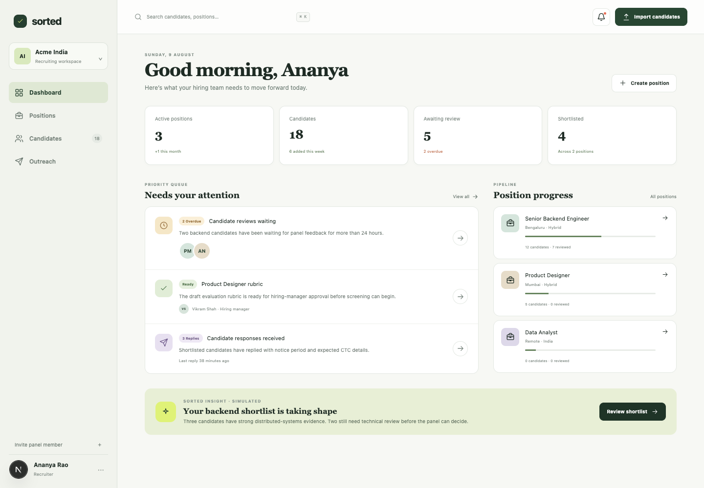
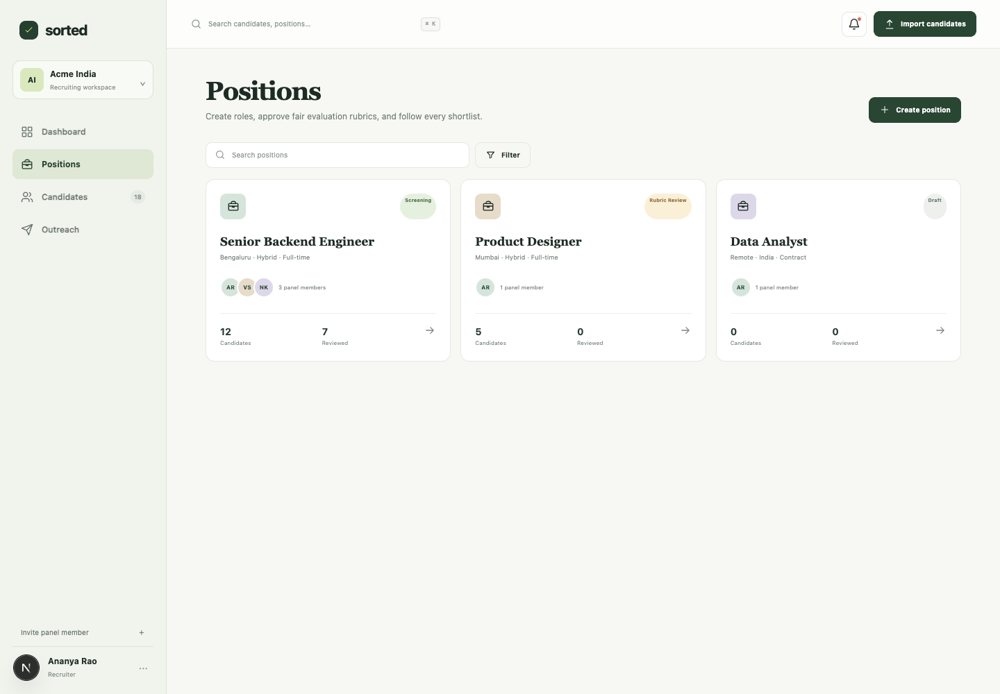
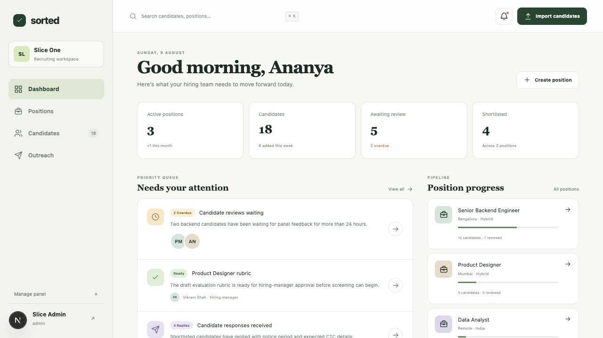
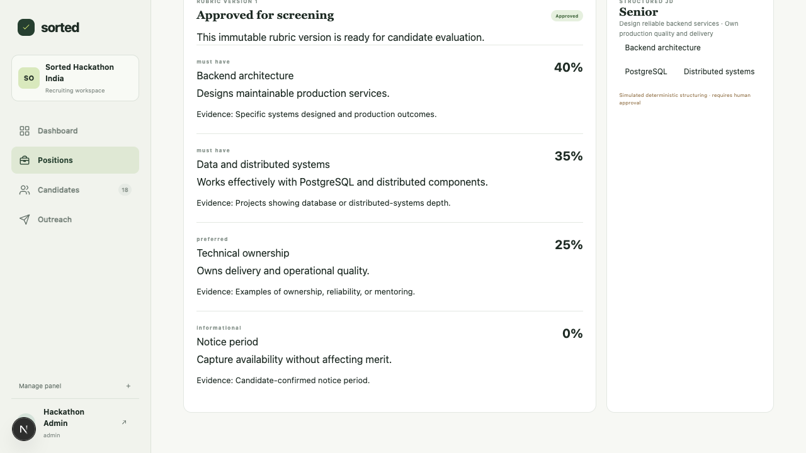

# Sorted Recruiting

Sorted is an evidence-first AI screening workspace for Indian hiring teams, built for the Sarvam Building Hours Hackathon. It helps recruiters turn inbound CVs into evidence profiles, compare candidates against an approved position rubric, collaborate on shortlisting, and move qualified candidates toward recruiter screening through approved outreach.

The product stops at the interview boundary. It does not conduct interviews, schedule them, autonomously reject candidates, or send unapproved outreach.

## Current phase

Slice 0 of [`plan.md`](./plan.md) establishes the recruiting-oriented product shell and delivery foundations:

- Dashboard, Positions, Candidates, and Outreach routes
- Synthetic `Acme India` position, panel, and candidate fixtures
- Position and candidate detail layouts
- Persistent candidate-import entry point
- Typed fixture/service contracts with Zod validation
- Server-only environment validation
- Health and database-readiness endpoints
- Correlation IDs and structured log redaction
- Bun-based CI lint and production-build checks

All AI-labelled insight in this phase is explicitly marked simulated. No Sarvam API call, CV extraction, outreach delivery, or other external action occurs yet.

## Screenshots

Captured from browser validation runs; the full set lives in [`.images`](./.images).

| | |
|---|---|
|  <br> *Dashboard* |  <br> *Positions* |
|  <br> *Sign-up and sign-in* |  <br> *Manager-approved evaluation rubric* |

## Sarvam roadmap

- **Sarvam-105B** structures job descriptions into manager-approved rubrics in Slice 2, extracts evidence profiles in Slice 4, evaluates evidence against individual rubric criteria in Slice 5, and drafts approved outreach in Slice 7.
- **Saaras** supports reviewed multilingual recruiter voice notes in Slice 9.
- **Bulbul** provides opt-in multilingual audio versions of approved candidate messages in Slice 10.

Provider clients remain server-only and return normalized Sorted domain objects. Deterministic fake providers will cover tests and demos. Never put `SARVAM_API_KEY` in browser code or commit it to Git.

## Local development

Requirements: Bun and Node-compatible PostgreSQL tooling. Local development uses PGlite by default.

```bash
cp .env.example .env.local
bun install
bun run db:generate
bun run db:init
bun run dev:next
```

`db:init` creates the local PGlite schema and seeds a complete synthetic recruiting journey.
When the database server is already running, `bun run db:seed` safely restores any missing
demo rows without deleting or replacing existing data. The seed covers the local organization
and panel, positions and rubrics, CV sources and evidence, evaluations, review and shortlist,
approved simulated outreach, a candidate reply, and the recruiter-screening handoff.
The primary synthetic login is `demo@sorted.local` / `demo`; do not use these credentials for a
real workspace.

Open [http://localhost:7070](http://localhost:7070).

Store the rotated Sarvam credential only in `.env.local` when a Sarvam-backed slice is implemented:

```bash
SARVAM_API_KEY="your-rotated-server-only-key"
```

## Deploy to Render

The repo ships a [`render.yaml`](./render.yaml) blueprint: a Next.js web service, a background worker draining the Postgres job queue, and a managed PostgreSQL database with `DATABASE_URL` wired automatically. Bun runs natively on Render, so no Docker is required. **Full walkthrough, architecture, day-2 operations, and troubleshooting: [`DEPLOYMENT.md`](./DEPLOYMENT.md).**

Quick start:

1. Push this repository to GitHub (`main` branch).
2. In the [Render dashboard](https://dashboard.render.com), click **New → Blueprint**, and select the repo.
3. Render provisions `sorted-web`, `sorted-worker`, and `sorted-db`, then deploys. The web service runs `prisma migrate deploy` in its predeploy step, so the schema is applied before traffic starts.

Verify the live app:

```bash
curl https://<your-app>.onrender.com/api/health
curl https://<your-app>.onrender.com/api/ready
```

Highlights (details in DEPLOYMENT.md):

- The blueprint uses Render's free tier. The web service spins down after ~15 minutes idle, and free PostgreSQL instances expire after 30 days — upgrade before then if the environment should persist.
- Production runs on `DATABASE_URL="postgresql://…"`; the app falls back to local PGlite only when the URL starts with `file:`.
- Schema changes ship as new migrations under `prisma/migrations/` (`bun run db:migrate` locally, `prisma migrate deploy` on deploy). Never `db:push` against the production database...
- Set `APP_URL` to the onrender.com URL after the first deploy; add `SARVAM_API_KEY` as a server-only environment variable when a Sarvam-backed slice ships (never `NEXT_PUBLIC_`).

## Verification

```bash
bun run lint
bun run build
curl http://localhost:7070/api/health
curl http://localhost:7070/api/ready
```

Browser validation captures are stored in [`.images`](./.images).

## Architecture

Recruiting domain contracts, fixtures, and services live under `src/features/sorted`. Pages remain Server Components unless browser interactivity is required. Database-backed services will use parameterized SQL through `executeQuery()` and preserve PGlite/PostgreSQL compatibility.

See [`AGENTS.md`](./AGENTS.md) for engineering constraints and [`plan.md`](./plan.md) for vertical-slice delivery scope.
